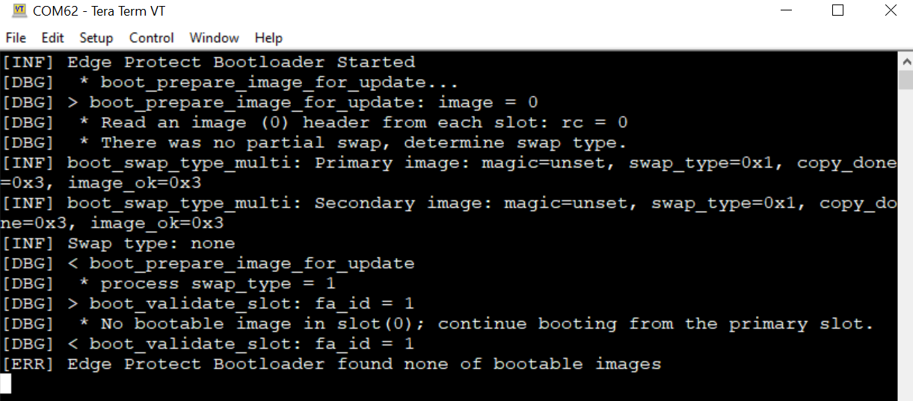

# XMC7000: OTW firmware upgrade

[MCUboot](https://github.com/mcu-tools/mcuboot) is an open-source library enabling the development of secure bootloader applications for 32-bit MCUs. MCUboot is the primary bootloader in popular IoT operating systems such as Zephyr and Apache Mynewt.

[DFU middleware library](https://github.com/Infineon/dfu) protocol is a middleware library provided by Infineon. This protocol supports a serial interface to upgrade the image.

This example demonstrates a firmware upgrade for the XMC7000 using the edge protect bootloader and DFU. It bundles two applications:

- **Edge protect bootloader application** consists of a MCUboot-based bootloader application run by the CM0+ core. The bootloader handles DFU application image authentication and upgrades. When the image is valid, the bootloader will boot the DFU image by using the starting address of the primary slot.

   **Flash boot** handles the edge protect bootloader image authentication. When the image is valid, flash boot will boot the bootloader image. Flash boot can be configured to run in secure mode (Secure protection state) or in normal mode (Normal protection state):

   - **Normal protection state:** Flash boot will boot the bootloader without authentication.

   - **Secure protection state:** Flash boot will boot the bootloader once authentication is successful. If the bootloader image is found to be invalid or corrupted, the device will enter a DEAD protection state and stay in the DEAD protection state until the device is reset.
<br>

- **DFU application:** consist of a [DFU middleware library](https://github.com/Infineon/dfu)-based DFU application run by the CM7 core. The DFU application downloads the image and stores it in the secondary slot (flash memory) via serial interface.

   **DFU host tool** is a GUI-based tool that will send the image via serial interface to the device.

    This application can be built in one of the following ways:

   - **BOOT mode:** The application image is built to be programmed into the primary slot. The bootloader will simply boot the application on the next reset.

   - **UPGRADE mode:** The application image is built to be programmed into the secondary slot. Based on user input, the bootloader will copy the image into the primary slot and boot it on the next reset.

[View this README on GitHub.](https://github.com/Infineon/mtb-example-xmc7000-otw-firmware-upgrade)

[Provide feedback on this code example.](https://cypress.co1.qualtrics.com/jfe/form/SV_1NTns53sK2yiljn?Q_EED=eyJVbmlxdWUgRG9jIElkIjoiQ0UyMzc5NDMiLCJTcGVjIE51bWJlciI6IjAwMi0zNzk0MyIsIkRvYyBUaXRsZSI6IlhNQzcwMDA6IE9UVyBmaXJtd2FyZSB1cGdyYWRlIiwicmlkIjoic3JkcyIsIkRvYyB2ZXJzaW9uIjoiMi4wLjEiLCJEb2MgTGFuZ3VhZ2UiOiJFbmdsaXNoIiwiRG9jIERpdmlzaW9uIjoiTUNEIiwiRG9jIEJVIjoiSUNXIiwiRG9jIEZhbWlseSI6IlBTT0MifQ==)

## Requirements

- [ModusToolbox&trade;](https://www.infineon.com/modustoolbox) v3.1 or later (tested with v3.2)
- Programming language: C
- Associated parts: [XMC7000 MCU](https://www.infineon.com/cms/en/product/microcontroller/32-bit-industrial-microcontroller-based-on-arm-cortex-m/)
- [CySecureTools](https://pypi.org/project/cysecuretools/): v5.0.0
- Other tools: Python v3.8.10 or later
- BSP version: 2.x

## Supported toolchains (make variable 'TOOLCHAIN')

- GNU Arm&reg; Embedded Compiler v11.3.1 (`GCC_ARM`) – Default value of `TOOLCHAIN`


## Supported kits (make variable 'TARGET')

- [XMC7200 Evaluation Kit](https://www.infineon.com/KIT_XMC72_EVK) (`KIT_XMC72_EVK`, `KIT_XMC72_EVK_MUR_43439M2`) - Default value of `TARGET`
- [XMC7100 Evaluation Kit](https://www.infineon.com/KIT_XMC71_EVK_LITE_V1) (`KIT_XMC71_EVK_LITE_V1`)


## Hardware setup
- XMC7000
    - UART (KitProg3): To get the debug log messages
    - I2C (KitProg3): For DFU transport
- [MiniProg4](https://www.infineon.com/cms/en/product/evaluation-boards/cy8ckit-005)
  - UART/SPI: For DFU transport

This example uses kit's default configuration. See the kit user guide to ensure that the board is configured correctly.


## Software setup

See the [ModusToolbox&trade; tools package installation guide](https://www.infineon.com/ModusToolboxInstallguide) for information about installing and configuring the tools package.

1. Install a terminal emulator if you don't have one. Instructions in this document use [Tera Term](https://teratermproject.github.io/index-en.html).

2. Install the Python interpreter and add it to the top of the system path in environmental variables. This code example is tested with [Python v3.8.10](https://www.python.org/downloads/release/python-3810/).


## Using the code example

### Create the project

The ModusToolbox&trade; tools package provides the Project Creator as both a GUI tool and a command line tool.

<details><summary><b>Use Project Creator GUI</b></summary>

1. Open the Project Creator GUI tool.

   There are several ways to do this, including launching it from the dashboard or from inside the Eclipse IDE. For more details, see the [Project Creator user guide](https://www.infineon.com/ModusToolboxProjectCreator) (locally available at *{ModusToolbox&trade; install directory}/tools_{version}/project-creator/docs/project-creator.pdf*).

2. On the **Choose Board Support Package (BSP)** page, select a kit supported by this code example. See [Supported kits](#supported-kits-make-variable-target).

   > **Note:** To use this code example for a kit not listed here, you may need to update the source files. If the kit does not have the required resources, the application may not work.

3. On the **Select Application** page:

   a. Select the **Applications(s) Root Path** and the **Target IDE**.

   > **Note:** Depending on how you open the Project Creator tool, these fields may be pre-selected for you.

   b.	Select this code example from the list by enabling its check box.

   > **Note:** You can narrow the list of displayed examples by typing in the filter box.

   c. (Optional) Change the suggested **New Application Name** and **New BSP Name**.

   d. Click **Create** to complete the application creation process.

</details>

<details><summary><b>Use Project Creator CLI</b></summary>

The 'project-creator-cli' tool can be used to create applications from a CLI terminal or from within batch files or shell scripts. This tool is available in the *{ModusToolbox&trade; install directory}/tools_{version}/project-creator/* directory.

Use a CLI terminal to invoke the 'project-creator-cli' tool. On Windows, use the command-line 'modus-shell' program provided in the ModusToolbox&trade; installation instead of a standard Windows command-line application. This shell provides access to all ModusToolbox&trade; tools. You can access it by typing "modus-shell" in the search box in the Windows menu. In Linux and macOS, you can use any terminal application.

The following example clones the "[mtb-example-xmc7000-otw-firmware-upgrade](https://github.com/Infineon/mtb-example-xmc7000-otw-firmware-upgrade)" application with the desired name "xmc7000-otw-firmware-upgrade" configured for the *KIT_XMC72_EVK* BSP into the specified working directory, *C:/mtb_projects*:

   ```
   project-creator-cli --board-id KIT_XMC72_EVK --app-id xmc7000-otw-firmware-upgrade --user-app-name xmc7000-otw-firmware-upgrade --target-dir "C:/mtb_projects"
   ```


The 'project-creator-cli' tool has the following arguments:

Argument | Description | Required/optional
---------|-------------|-----------
`--board-id` | Defined in the <id> field of the [BSP](https://github.com/Infineon?q=bsp-manifest&type=&language=&sort=) manifest | Required
`--app-id`   | Defined in the <id> field of the [CE](https://github.com/Infineon?q=ce-manifest&type=&language=&sort=) manifest | Required
`--target-dir`| Specify the directory in which the application is to be created if you prefer not to use the default current working directory | Optional
`--user-app-name`| Specify the name of the application if you prefer to have a name other than the example's default name | Optional

> **Note:** The project-creator-cli tool uses the `git clone` and `make getlibs` commands to fetch the repository and import the required libraries. For details, see the "Project creator tools" section of the [ModusToolbox&trade; tools package user guide](https://www.infineon.com/ModusToolboxUserGuide) (locally available at {ModusToolbox&trade; install directory}/docs_{version}/mtb_user_guide.pdf).

</details>


### Open the project

After the project has been created, you can open it in your preferred development environment.


<details><summary><b>Eclipse IDE</b></summary>

If you opened the Project Creator tool from the included Eclipse IDE, the project will open in Eclipse automatically.

For more details, see the [Eclipse IDE for ModusToolbox&trade; user guide](https://www.infineon.com/MTBEclipseIDEUserGuide) (locally available at *{ModusToolbox&trade; install directory}/docs_{version}/mt_ide_user_guide.pdf*).

</details>


<details><summary><b>Visual Studio (VS) Code</b></summary>

Launch VS Code manually, and then open the generated *{project-name}.code-workspace* file located in the project directory.

For more details, see the [Visual Studio Code for ModusToolbox&trade; user guide](https://www.infineon.com/MTBVSCodeUserGuide) (locally available at *{ModusToolbox&trade; install directory}/docs_{version}/mt_vscode_user_guide.pdf*).

</details>


<details><summary><b>Keil µVision</b></summary>

Double-click the generated *{project-name}.cprj* file to launch the Keil µVision IDE.

For more details, see the [Keil µVision for ModusToolbox&trade; user guide](https://www.infineon.com/MTBuVisionUserGuide) (locally available at *{ModusToolbox&trade; install directory}/docs_{version}/mt_uvision_user_guide.pdf*).

</details>


<details><summary><b>IAR Embedded Workbench</b></summary>

Open IAR Embedded Workbench manually, and create a new project. Then select the generated *{project-name}.ipcf* file located in the project directory.

For more details, see the [IAR Embedded Workbench for ModusToolbox&trade; user guide](https://www.infineon.com/MTBIARUserGuide) (locally available at *{ModusToolbox&trade; install directory}/docs_{version}/mt_iar_user_guide.pdf*).

</details>


<details><summary><b>Command line</b></summary>

If you prefer to use the CLI, open the appropriate terminal, and navigate to the project directory. On Windows, use the command-line 'modus-shell' program; on Linux and macOS, you can use any terminal application. From there, you can run various `make` commands.

For more details, see the [ModusToolbox&trade; tools package user guide](https://www.infineon.com/ModusToolboxUserGuide) (locally available at *{ModusToolbox&trade; install directory}/docs_{version}/mtb_user_guide.pdf*).

</details>


## Operation

This example bundles two applications: the bootloader application run by the CM0+ core and the DFU application run by the CM7 core. Build and program the applications in the following order: Do not start building the applications. Follow the [step-by-step instructions](#step-by-step-instructions).


### Step-by-step instructions

1. Connect the board to your PC using the provided USB cable through the KitProg3 USB connector.

2. Open a terminal program and select the KitProg3 COM port. Set the serial port parameters to 8N1 and 115200 baud.

3. Install the dependent modules for the [imgtool](https://pypi.org/project/imgtool/) Python module for image signing and key management.

   MCUboot already includes this module but not the dependent modules. Do the following:

   1. Open a CLI terminal and navigate to the *\<mtb_shared>/mcuboot/\<tag>/scripts* directory.

      On Windows, use the command line modus-shell program provided in the ModusToolbox&trade; installation instead of a standard Windows command line application. This shell provides access to all ModusToolbox&trade; tools. You can access it by typing `modus-shell` in the search box in the Windows menu.

      In Linux and macOS, you can use any terminal application.

   2. Run the following command to ensure the required modules are installed.
     

      ```
      python -m pip install -r requirements.txt
      ```
       > **Note:** For Linux and macOS platforms, use `python3` instead of `python` in this command.

4. To ensure that you are using the correct CySecureTools version, run the following command:

      ```
      python -m pip install --upgrade cysecuretools
      ```
     > **Note:** 
      -  Follow **Step 5** and **Step 6** to build and program the applications separately by using CLI.
      -  Follow **Step 7** to build and program combined image for both the applications by using CLI or Eclipse IDE.

5. Build and program the bootloader application using CLI.

   > **Note:** By default, the protection state is set to be secure. For authentication, in the pre-build, this code example will automatically generate the *cy_si_key.c* file using the default *cypress-test-rsa2k.pub* key. In the post-build steps, this code example will automatically generate the secure image by signing the image using the default *cypress-test-rsa2k.pem* key. The default cypress-test-rsa2k keys are present in the *\<application>/keys* folder. See [Generate permanent and public keys for edge protect bootloader authentication](#python-command-to-generate-permanent-and-public-keys-for-edge-protect-bootloader-authentication) under [Generating a key pair](#generating-a-key-pair) for generating a new key pair.
      
      To change the mode to a normal protection state, set the `USE_SECURE_MODE_FOR_MCUBOOT` variable to '0' in the *\<application>/user_config.mk* file.

     From the terminal, go to *\<application>/bootloader_cm0p* and execute the `make program_proj -j8` command to build and program the bootloader application.

      Example:
      ```
      make program_proj -j8
      ```

      After programming, once the bootloader has successfully booted, confirm that the UART terminal displays a message as shown in **Figure 1**.

      **Figure 1. Booting with no bootable image**

      

6. Build and program the DFU application in the BOOT mode using CLI.

   > **Note:** I2C is configured as the default DFU transport. To change the DFU transport, edit the *\<application>/user_config.mk* file to set `SELECTED_TRANSPORT=<DFU_TRANSPORT>`. 
   
   To change the default DFU transport configurations according to the use case, see [DFU transport configurations](#dfu-transport-configurations).

     From the terminal, go to *\<application>/dfu_cm7* and  execute the `make program_proj -j8` command to build and program the application using the default DFU transport. You can specify a transport manually:
      ```
      make program_proj -j8 SELECTED_TRANSPORT=<DFU_TRANSPORT>
      ```

      Example:
      ```
      make program_proj -j8 SELECTED_TRANSPORT=UART
      ```  
      After programming, the bootloader starts automatically. The bootloader validates the boot image. If the validation is successful, the bootloader will let CM7 run the DFU application. The DFU application will wait for the DFU host tool command. Confirm that the user LED 1 toggles approximately at a one second interval and the UART terminal displays a message as shown in **Figure 2**.

    **Figure 2. Booting with the DFU app in the BOOT mode and upgrade process is OVERWRITE**

    

    **Figure 3. Booting with the DFU app in the BOOT mode and upgrade process is SWAP**

    

7. Build and program the combined image for bootloader and DFU applications.
  
   <details><summary><b>Using Eclipse IDE</b></summary>

      1. Select the application project in the Project Explorer.

      2. In the **Quick Panel**, scroll down, and click **Build \<Application name>**.
      </details>


   <details><summary><b>In other IDEs</b></summary>

   Follow the instructions in your preferred IDE.
   </details>


   <details><summary><b>Using CLI</b></summary>

     From the terminal, go to *\<application>* and execute the `make program_proj -j8` command to build and program the application using the default DFU transport. You can specify a transport manually:
      ```
      make program -j8 SELECTED_TRANSPORT=<DFU_TRANSPORT>
      ```

      Example:
      ```
      make program -j8 SELECTED_TRANSPORT=UART
      ```
      </details>
    
8. After programming, once the bootloader has successfully booted, the bootloader validates the boot image. If the validation is successful, the bootloader will let CM7 run the DFU application. The DFU application will wait for the DFU host tool command. Confirm that the user LED 1 toggles approximately at a one second interval and the UART terminal displays a message as shown in **Figure 4**.

      **Figure 4. Booting with the DFU app in the BOOT mode and upgrade process is OVERWRITE**

      

9. Build (Do **not** program) the DFU application in the UPGRADE mode.
 
   > **Note:** BOOT is configured as the default image type. To change the image type, edit the *\<application>/user_config.mk* to set `IMG_TYPE=UPGRADE`.
     <details open><summary><b>Using Eclipse IDE for ModusToolbox&trade; software</b></summary>

      1. Select the 'dfu_cm7' application in the project explorer.

      2. Edit the *user_config.mk* file and update the value of the `IMG_TYPE` variable to `UPGRADE`.

      3. In the **Quick Panel**, scroll down, and click **Build \<Application name>**.
   </details>

   <details open><summary><b>Using CLI</b></summary>

      From the terminal, go to *\<application>/dfu_cm7* directory and execute the following command to build the application using the default toolchain to the default target:

      ```
      make build_proj -j8 IMG_TYPE=UPGRADE
      ```
   </details>

10. Perform the Device Firmware Upgrade using the DFU host tool:

      1. Open the [DFU host tool](https://www.infineon.com/dgdl/Infineon-ModusToolbox_DFU_Host_Tool_1.60_User_Guide-UserManual-v01_00-EN.pdf?fileId=8ac78c8c8386267f0183a95733d6596e). Connect to the board using the transport configured.
   
      2. Select *dfu_cm7.hex*. By default, it is generated in the *\<application>/dfu_cm7/build/UPGRADE/\<TARGET>/\<CONFIG>* directory on a successful build.
   
      3. Select an appropriate port based on the transport (`SELECTED_TRANSPORT`) configured in the DFU application. I2C is the default transport configuration. Select **400 kHz** speed, set the address to **12**, and then click **Program**.
   
      4. Observe the image download progress status on the progress bar and wait for the download to complete.

         > **Note:** See [DFU host tool](https://www.infineon.com/dgdl/Infineon-ModusToolbox_DFU_Host_Tool_1.60_User_Guide-UserManual-v01_00-EN.pdf?fileId=8ac78c8c8386267f0183a95733d6596e) documentation for further details on selecting a port and configuring it for communication based on the transport enabled in the bootloader.

         **Figure 5. Downloading the application using the DFU host tool**

         

         After a successful download, the DFU application will do a soft reset.

11. After a soft reset, the bootloader starts automatically. The bootloader validates the upgrade image and upgrades the image by copying the image from the secondary slot to the primary slot. Then the bootloader lets CM7 run the upgraded image.

    1. For an overwrite-based upgrade, confirm that the user LED 2 toggles approximately at the one second interval and the UART terminal displays the message as shown in **Figure 6**. 

       **Figure 6. Booting the DFU app in the UPGRADE mode after successful OVERWRITE operation**

       

    2. For a swap-based upgrade, enter 'Y' in the UART terminal to make the upgrade image as the permanent primary image or enter 'N' to revert back to the boot image. In case of the 'N' response, confirm that the boot image boots on the next reset. Confirm that the user LED 1 or 2 toggles approximately at the one second interval according to our response, and the UART terminal displays the message as shown in **Figure 7**. 

       **Figure 7. Booting the DFU app in the UPGRADE mode after successful SWAP operation with response YES**

       
       
       **Figure 8. Booting the DFU app in the UPGRADE mode after successful SWAP operation with response NO**

       


> **IMPORTANT:** Once the secure protection state is implemented on the device, the device will boot only the secure image. If you want to switch to the normal protection state, erase the TOC2 structure and public key content on the flash. For erasing, run [OpenOCD script](#openocd-script) on the device and set the variable `USE_SECURE_MODE_FOR_MCUBOOT` to '0' in the *\<application>/user_config.mk* file, and then build and program the edge protect bootloader on the device.

> **NOTE:** You can build the combined image for bootloader and dfu applications using the `make build` CLI command in the *\<application>* directory but during the linking stage there might be an error stating multiple definitions of symbols for dfu application for `BOOT` and `UPGRADE` image. Currently, the solution to the problem has been addressed in the following code section of the *\<application>/dfu_cm7/Makefile* which ignores the build artifacts of the other `IMG_TYPE`. Ex: If `BOOT` is selected as `IMG_TYPE` then *\<application>/dfu_cm7/build/UPGRADE* build directory artifacts will be ignored during the compilation and linking of the `BOOT` image.

      ```
      ifeq ($(IMG_TYPE), BOOT)
      CY_IGNORE+=build/UPGRADE
      else
      ifeq ($(IMG_TYPE), UPGRADE)
      CY_IGNORE+=build/BOOT
      endif
      endif
      ```

For programming the individual builds of the bootloader and dfu applications, use the `make program_proj` CLI command as shown in the preceding steps.

## Debugging

You can debug the example to step through the code.


<details><summary><b>In Eclipse IDE</b></summary>

Use the **\<Application Name> Debug (KitProg3_MiniProg4)** configuration in the **Quick Panel**. For details, see the "Program and debug" section in the [Eclipse IDE for ModusToolbox&trade; user guide](https://www.infineon.com/MTBEclipseIDEUserGuide).


</details>


<details><summary><b>In other IDEs</b></summary>

Follow the instructions in your preferred IDE.
</details>


## Design and implementation


### Overview

This code example consists of DFU middleware which downloads (secondary slot) the image through serial interface via DFU host tool and reset the device. During reset, bootloader authenticates the downloaded image and moves it into primary slot to boot the image.


### Boot sequence

**Figure 9** shows how the CM0+ operation starts from reset. After reset, CM0+ starts executing from ROM boot. ROM boot validates the SFlash. After the validation, execution jumps to flash boot and configures DAP as required by the protection state. Notice the color coding that depicts the memory type where the data and code resides.

Flash boot then validates the first application listed in TOC2 and jumps to its entry point if validated. In the secure protection state, the first user application is the secure image. After the secure image configures the hardware to secure the system, it validates the main user application if required.

If the SFlash or secure image is found to be invalid or corrupted, the device enters a DEAD protection state and stays in the DEAD protection state until the device is reset.

> **Note:** If the device enters the DEAD protection state, it cannot transition to the RMA lifecycle stage. Failure analysis cannot be performed in such cases. TOC2 is an area in the SFlash used to store pointers to two application blocks: the secure image and the main user application. It also contains some boot parameters that can be set by the system designer.

**Figure 9. Boot sequence flow**


### MCUboot basics

[MCUboot](https://github.com/mcu-tools/mcuboot) library helps implement secured bootloader applications for 32-bit MCUs. The MCUboot repo on [GitHub](https://github.com/mcu-tools/mcuboot) also includes two applications, MCUbootApp and BlinkyApp for XMC7000 devices.

MCUboot works by dividing the flash into two slots per image: primary and secondary. The first version of the application is programmed into the primary slot during production. A firmware update (DFU) application running in the device receives the upgrade image over an I2C, UART, or SPI serial communication interface and places it in the secondary slot. This slot-based partition helps in read/write-protecting the primary slot from a less-privileged application.

Typically, a bootloader application executes in secured mode and is privileged to access the primary slot, while a less-privileged application, such as an upgrade application, cannot access the primary slot but can access the secondary slot.

MCUboot always boots from the primary slot and copies the image from the secondary slot into the primary slot when an upgrade is requested. The upgrade can be either overwrite-based or swap-based. In an overwrite-based upgrade, the image in the primary slot is lost and there is no way to roll back, if the new image has an issue. In a swap-based upgrade, the images are swapped between the two slots, and rollback is possible. In this case, MCUboot makes use of an additional area in the flash called the *scratch area* for reliable swapping. MCUboot for the XMC7000 supports both swap-based and overwrite-based upgrades.

For a swap-based upgrade, each image slot contains the metadata used by MCUboot to determine the current state and actions to take during the current boot operation. In case of an upgrade image, the `img_ok` field is updated by the application to make the current image permanent in the primary slot. See the [image trailer](https://github.com/mcu-tools/mcuboot/blob/v1.9.1-cypress/docs/design.md#image-trailer) for more details.

MCUboot implements reset recovery and resumes the copy operation if a reset or power failure occurs during the operation. **Figure 2** shows the execution flow of the edge protect bootloader application.

**Figure 10. Edge protect bootloader application flow**


#### Overwrite and swap-based upgrades for the XMC7000 device

There are two types of upgrade processes supported by the XMC7000 device.

- For an overwrite-based upgrade, the secondary image is simply copied to the primary slot after successful validation. There is no way to revert the upgrade if the secondary image is inoperable.
- For a swap-based upgrade, images in the primary and secondary slots are swapped. The upgrade can be reverted if the secondary image does not confirm its operation.

See the "Swap status partition description" section of the [MCUbootApp documentation](https://github.com/mcu-tools/mcuboot/blob/v1.9.1-cypress/boot/cypress/MCUBootApp/MCUBootApp.md) and [MCUboot design](https://github.com/mcu-tools/mcuboot/blob/v1.9.1-cypress/docs/design.md) documentation for more details.


### DFU application flow

The DFU application demonstrates DFU operations based on the DFU middleware library. **Figure 11**  shows the execution flow of the DFU application.

**Figure 11. DFU application flow**


#### DFU interfaces

The DFU application supports I2C, UART and SPI interfaces for communicating with the DFU host tool. See **Table 1** for the default configuration details. You can change these default configurations according to the use case. However, you must ensure that the configuration of the DFU host tool matches the DFU application. Refer [DFU transport configurations](#dfu-transport-configurations) to change the default DFU transport configurations according to the use case in our DFU application.

**Table 1. Default DFU transport configurations**
    
  DFU transport: I2C| Default |Description
   :--------------- | :------ | :-----
   Mode             | Slave   | Device acts as a slave
   Address          | 12      | 7-bit slave device address
   Data rate        |400 kbps | DFU supports standard data rates from 50 kbps to 1 Mbps

   <br>

   DFU transport: UART| Default |Description
   :----------------- | :------- | :-----
   Mode               | Standard | Standard, SmartCard, and IrDA are supported UART modes in SCB
   Baud rate(bps)     | 115200   | Supports standard baud rates from 19200 to 115200
   Data width         | 8 bits   | Standard frame
   Parity             | None     | Standard frame
   Stop bits          | 1 bit    | Standard frame
   Bit order          | LSB first| Standard frame

   <br>

   DFU transport: SPI | Default  |Description
   :------------------| :------  | :-----
   Mode               | Slave    | Device acts as a slave
   Shift direction    | MSB first| default direction set as MSB first  
   Clock speed        | 1 MHz    | DFU supports 1 MHz, 2MHz, 4MHz and 6MHz SPI Clock speed
   Mode               | Mode 00  | default mode set as Mode 00

   <br>


#### DFU transport configurations

#### How to change the configuration for DFU I2C transport

#### Hardware configuration

Uses the board's default configuration.

#### Software configuration

To change the default configuration, edit the *\<application>/dfu_cm7/imports/dfu/config/COMPONENT_CAT1/COMPONENT_DFU_I2C/transport_i2c.c* file according to the use case.

#### How to change the configuration for DFU UART transport

#### Hardware configuration

Connect the RX and TX pins of MiniProg4 to P20_4 and P20_3 on the board respectively. Also, connect the VTARG and GND of MiniProg4 to 3.3 V and GND on the board respectively.

#### Software configuration

To change the default configuration, edit the *\<application>/dfu_cm7/imports/dfu/config/COMPONENT_CAT1/COMPONENT_DFU_UART/transport_uart.c* file according to the use case.

#### How to change the configuration for DFU SPI transport

#### Hardware configuration

For XMC7200 kit, Connect the MISO, MOSI, CLK and CS pins of MiniProg4 to P10_0, P10_1, P10_2 and P10_3 on the board respectively. And also connect the VTARG and GND of MiniProg4 to 3.3 V and GND on the board respectively.

For XMC7100 kit, Connect the MISO, MOSI, CLK and CS pins of MiniProg4 to P13_0, P13_1, P13_2 and P13_3 on the board respectively. And also connect the VTARG and GND of MiniProg4 to 3.3 V and GND on the board respectively.


#### Software configuration

To change the default configuration, edit the *\<application>/dfu_cm7/imports/dfu/config/COMPONENT_CAT1/COMPONENT_DFU_SPI/transport_spi.c* file according to the use case.


## Memory map/partition

**Figure 12** shows a typical memory map or partition used with MCUboot. The partitions need not be contiguous in memory as it is possible to configure the offset and size of each partition. However, the offset and the size must be aligned to the boundary of a flash row or sector. For XMC7000 MCUs, the size of a flash row is 512 bytes. The partition can only be in the internal flash (external flash is not supported at the moment).

The memory partition is described or defined through a memory map (a JSON file; see the *\<application>/flashmap* directory for examples). It is important for the bootloader and DFU applications to agree on the memory map. This example uses an *\<application>/user_config.mk* file between the two apps, and the *memorymap.mk* file is auto-generated from the memory map JSON file so that they can use the same set of memory map parameters. See configuring the default memory map for details.

**Figure 12. Typical memory map**


### Sample memory maps

Following images illustrate the memory maps provided in this code example. The flashmap JSON files are located in the *\<application>/flashmap* directory. 

**Figure 13. Primary and secondary slots in internal flash**


### Customizing and selecting the memory map

A memory map, for example, is selected by changing the value of the `FLASH_MAP` variable in the *\<application>/user_config.mk* file to the desired JSON file name.

See the [How to modify memory map](https://github.com/mcu-tools/mcuboot/blob/v1.9.1-cypress/boot/cypress/MCUBootApp/MCUBootApp.md#how-to-modify-flash-map) section to understand how to customize the memory map to the use case.

During the pre-build stage, the memorymap JSON file is automatically parsed by the *\<application>/scripts/memorymap_xmc7000.py* Python script to generate the following files:

1. *memorymap.mk*, *memorymap.c*, and *memorymap.h* files in the bootloader application.
2. *memorymap.mk*, *memorymap.c*, and *memorymap.h* files in the DFU application.

The parameters generated in the *memorymap.mk* file are used in the `DEFINES` and `LDFLAGS` variables of the application Makefile.

> **Note:** While modifying the memory map, make sure the primary slot, secondary slot, and bootloader application flash sizes are appropriate. This code example automatically matches the application linker script's flash memory allocation to the *memorymap.c* and *user_config.mk* files.


### Customizing the RAM area of CM0+ and CM7 applications

Modify the `BOOTLOADER_APP_RAM_SIZE` to change the CM0+ ram size and the `USER_APP_RAM_SIZE` to change the CM7 ram size in the *\<application>/user_config.mk* file.

> **Note:** Make sure the RAM areas of CM0+-based bootloader and the CM7-based DFU application do not overlap.
Memory (stack) corruption of CM0+ application can cause failure if SystemCall-served operations are invoked from CM7.


### Configuring make variables

This section explains the important make variables that affect the Edge protect bootloader functionality. Some of these variables are autogenerated from the memorymap JSON file and some variables can be updated directly in the Makefile or passed along with the `make build` command.


#### Common make variables

These variables are common to both the bootloader and DFU applications, its configured via *\<application>/user_config.mk* file.

**Table 2: Common make variables**

 Variable | Default value | Description  
 -------- | ------------- |------------  
 `FLASH_MAP`             | xmc7000_overwrite_single.json | Valid values: `xmc7000_overwrite_single.json`, `xmc7000_swap_single.json`. Flashmap JSON file name.
 `SIGN_KEY_FILE`             | cypress-test-ec-p256 | Name of the private and public key files (the same name is used for both keys).
 `APP_CORE_ID`| 0 | Bootloader designed like user application can either run on CM7_0 or CM7_1 cores. By default, DFU application run on the CM7_0 core. Can change the core by setting the value to `1`.
 `BOOTLOADER_SIZE`           | Autogenerated       | Flash size of the bootloader application run by CM0+. <br>In the linker script for the bootloader application (CM0+), the `LENGTH` of the `cm0_flash` region is set to this value.<br>In the linker script for the DFU application (CM7), the `ORIGIN` of the `flash` region is offset to this value. 
 `BOOTLOADER_APP_RAM_SIZE`   | 0x20000              | RAM size of the bootloader application run by CM0+. <br>In the linker script for the bootloader application (CM0+), the `LENGTH` of the `cm0_ram` region is set to this value.<br/>In the linker script for the DFU application (CM7), the `ORIGIN` of the `ram` region is offset to this value, and the `LENGTH` of the `ram` region is calculated based on this value.
  `USER_APP_RAM_SIZE`   | 0x60000            | RAM size of the user application run by CM7. <br>In the linker script for the DFU application (CM7), the `LENGTH` of the `ram` region is set to this value.
 `SLOT_SIZE`                 | Autogenerated       | Size of the primary slot and secondary slot. i.e., the flash size of the DFU application run by CM7. 
 `MCUBOOT_HEADER_SIZE`       | 0x400                | Size of the MCUboot header. Must be a multiple of 1024 (see the following note).<br>Used in the following places:<br>1. In the linker script for the DFU application (CM7), the starting address of the `.text` section is offset by the MCUboot header size from the `ORIGIN` of the `flash` region. This is to leave space for the header that the *imgtool* inserts later during the post-build steps. <br>2. Passed to the *imgtool* while signing the image. The *imgtool* fills the space of this size with 0xFF (depending on internal or external flash) and then adds the actual header from the beginning of the image.
 `MAX_IMG_SECTORS`           | Autogenerated       | Maximum number of flash sectors (or rows) per image slot for which swap status is tracked in the image trailer.  
 `MCUBOOT_IMAGE_NUMBER`      | Autogenerated       | The number of images supported in the case of multi-image bootloading. Multi-image bootloading is not supported at the moment for XMC7000.
 `PRIMARY_IMG_START`         | Autogenerated       | Starting address of primary slot.
 `SECONDARY_IMG_START`        | Autogenerated       | Starting address of secondary slot.
 `USE_OVERWRITE`              | Autogenerated       | The value is '1' when scratch and status partitions are not defined in the flashmap JSON file.<br> **Note:** These variables are defined in *memorymap.mk* file.

<br>

> **Note:** The value of `MCUBOOT_HEADER_SIZE` must be a multiple of 1024 because the CM7 image begins immediately after the MCUboot header and it begins with the interrupt vector table. For the XMC7000 device, the starting address of the interrupt vector table must be 1024-bytes aligned.

`Number of bytes to be aligned to = Number of interrupt vectors x 4 bytes`

i.e., 1024 = 256 vectors x 4 bytes (32-bit address) per vector.


#### **Bootloader application make variables**

These variables are configured via *\<application>/user_config.mk*.

**Table 3: Bootloader application make variables**

 Variable             | Default value | Description  
 -------------------- | ------------- | ----------------
 `USE_SECURE_MODE_FOR_MCUBOOT`    | 1       | By default, the protection state is a secure protection state. To change the state to a normal protection state, set the variable to '0'. 
 `SECURE_MODE_KEY_FILE`             | cypress-test-rsa2k | Name of the private and public key files (the same name is used for both keys). |
 `USE_SW_DOWNGRADE_PREV`        | 1       | Downgrade prevention, Value is '1' to avoid older firmware versions for upgrade.
 `USE_BOOTSTRAP`        | 1       | When set to '1' and Swap mode is enabled, the application in the secondary slot will overwrite the primary slot if the primary slot application is invalid.

<br>

#### **DFU application make variables**

These variables are configured via *\<application>/user_config.mk*.

**Table 4: DFU application make variables**

 Variable       | Default value    | Description 
 -------------- | -----------------| -------------
 `IMG_TYPE`        | BOOT   | Valid values: `BOOT`, `UPGRADE`<br>**BOOT:** Use when the image is built for the primary slot. The `--pad` argument is not passed to the *imgtool*. <br/>**UPGRADE:** Use when the image is built for the secondary slot.  The `--pad` argument is passed to the *imgtool*.<br>Also, the DFU application defines different user LED toggles depending on whether the image is BOOT type or UPGRADE type.
 `SELECTED_TRANSPORT`        | I2C   | Valid values: I2C, UART, SPI<br>The DFU supports I2C, UART and SPI interfaces for communicating with the DFU host tool. These DFU transport can be changed according to the use case.
 `HEX_START_ADDR`   | Autogenerated | <br>if the image is **BOOT**, it will set the value as a `PRIMARY_IMG_START`and if the image is **UPGRADE**, it will set the value as a `SECONDARY_IMG_START`.
 `APP_VERSION_MAJOR`<br>`APP_VERSION_MINOR`<br>`APP_VERSION_BUILD` | 1.0.0 if `IMG_TYPE=BOOT`<br>2.0.0 if `IMG_TYPE=UPGRADE` | Passed to the *imgtool* with the `-v` option in *MAJOR.MINOR.BUILD* format, while signing the image. Also available as macros to the application with the same names. <br> **Note:** These variables are configured via *dfu_cm7/Makefile.mk*.

<br>

### Security 

#### Edge protect bootloader application authentication

#### XMC7000 Secure boot configuration description

Flash boot handles the edge protect bootloader image authentication. When the image is valid, flash boot boots the bootloader image. You can configure the flash boot to run either in secure (secure protection state) or normal mode (normal protection state):

- **Normal protection state:** Flash boot boots the bootloader without authentication.

- **Secure protection state:** Flash boot boots the bootloader once authentication is successful. If the bootloader image is found to be invalid or corrupted, the device enters a DEAD protection state and stays in the state until the device is reset.

The only difference between these two states is that the secure protection state requires additional configurations like TOC2, flash boot image header, and object trailer.

Edge protect bootloader application Makefile supports secure image build configuration for XMC7000.

To prepare a secure bootloader image, edit the variable `USE_SECURE_MODE_FOR_MCUBOOT=1` in the *\<application>/user_config.mk* file and need to configure the public key and specify the appropriate parameters for the TOC2 structure in the *cy_si_config.c* and *cy_si_key.c* files.

By default, the protection state is set to be secure. For authentication, in the pre-build, this code example will automatically generate the *cy_si_key.c* file using the default cypress-test-rsa2k.pub key. In the post-build, this code example will automatically generate the secure image by signing the image using the default cypress-test-rsa2k.pem key. The default cypress-test-rsa2k keys are present in the *\<application>/keys* folder.

The XMC7000 internal flash boot module can be used in secure configuration. See AN234802 for a complete description and instructions for configuring a secure boot.
  
See [Boot sequence](#boot-sequence) for the boot sequence of the secure protection state.

This example includes a sample key pair under the *\<application>/keys* directory. **You must not use this key pair in your end product.** See [Generate permanent and public keys for edge protect bootloader](#python-command-to-generate-permanent-and-public-keys-for-edge-protect-bootloader-authentication) under [Generating a key pair](#generating-a-key-pair) for generating a new key pair.


#### **DFU application authentication**

Edge protect bootloader checks the image integrity with SHA256, and image authenticity with EC256 digital signature verification. The bootloader application enables ECDSA SECP256R1 (EC256) by default. MCUboot uses the `Mbed TLS` library for cryptography.

> **Note:** Encryption image and hardware crypto acceleration are not supported at the moment for XMC7000.

MCUboot verifies the signature of the image in the primary slot before booting every time `MCUBOOT_VALIDATE_PRIMARY_SLOT` is defined. it also verifies the signature of the image in the secondary slot before copying it to the primary slot.

The bootloader application enables image authentication by uncommenting the following lines in the *\<application>/bootloader_cm0p/libs/mcuboot/boot/cypress/MCUbootApp/config/mcuboot_config/mcuboot_config.h* file:

```
#define MCUBOOT_SIGN_EC256
.
.
.
#define MCUBOOT_VALIDATE_PRIMARY_SLOT
```

When these options are enabled, the public key is embedded within the bootloader application. The DFU application is signed using the private key during the post-build steps. The *imgtool* Python module included in the MCUboot repository is used for signing the image.

This code example includes a sample key pair under the *\<application>/keys* directory. **You must not use this key pair in your end product.** See [Generate permanent and public keys for DFU application authentication](#python-command-to-generate-permanent-and-public-keys-for-dfu-application-authentication) under [Generating a key pair](#generating-a-key-pair) for generating a new key pair.


### Generating a key pair

#### Command to generate permanent and public keys for edge protect bootloader authentication

Use CySecureTools to generate the keys.

1. Generate the permanent and public keys:

   ```
   cysecuretools -t $(PLATFORM) create-key --key-type RSA2048 -o $(<application>)/keys/cypress-test-rsa2k.pem $(<application>)/keys/cypress-test-rsa2k.pub --format PEM 

   ```

2. Use the following command to generate *cy_si_key.c* file:

   ```
   cysecuretools convert-key -k $(<application>)/keys/cypress-test-rsa2k.pub -o $(mtb_stared_path)/platforms/utils/XMC7000/cy_si_key.c --fmt secure_boot --endian little

   ```
> **Note:** The command to generate the *cy_si_key.c* file is already implemented in the bootloader application. Basically, the *cy_si_key.c* file public key context automatically matches with the *cypress-test-rsa2k_gen.pub* file.


#### **Command to generate permanent and public keys for DFU application authentication**

You can use the *imgtool* Python module to generate the keys.

1. Generate the private key:

   ```
   python $(IMGTOOL_PATH)/imgtool.py keygen -k $(<application>)/keys/cypress-test-ec-p256.pem -t ecdsa-p256 

   ```

2. Generate the public key:

   ```
   python $(IMGTOOL_PATH)/imgtool.py getpub -k $(<application>)/keys/cypress-test-ec-p256.pem > $(<application>)/keys/$cypress-test-ec-p256.pub

   ```

> **Note:** You can create new keys by simply uncommenting the following in the `PREBUILD_VAR` variable present in the *\<application>/bootloader_cm0p/Makefile* file:

    `$(MAKE) gen_key_ecc256;` 
    `$(MAKE) gen_key_rsa2k;` 

> **IMPORTANT:** First, run the command to generate cypress-test-ec-p256 keys, and then run the command to generate the *cy_si_key.c* file in the *\<application>/bootloader_cm0p/Makefile* file, as follows:

```
PREBUILD_VAR=+\
$(MAKE) generate_flashmap_cm0p;\
$(MAKE) gen_key_ecc256;\
$(MAKE) gen_key_rsa2k;\
$(MAKE) gen_cy_si_key_source_file;
```


### OpenOCD script

#### To recover the device from secure mode to normal mode

To erase the TOC2 structure and public key content on the flash, run the following OpenOCD script on the device:

Create a file named *xmc7000_flash_erase.cfg* in the *C:/Users/ModusToolbox/tools_\<version>/openocd/scripts/interface* directory and copy the below content to the *xmc7000_flash_erase.cfg* file. Open the command prompt in the *C:/Users/ModusToolbox/tools_\<version>/openocd/bin* directory and run the command `openocd -s ../scripts -f ../scripts/interface/xmc7000_flash_erase.cfg`.

```
source [find interface/kitprog3.cfg]
set ENABLE_ACQUIRE 0
set ACQUIRE_TIMEOUT 2000

transport select swd
source [find target/cat1c.cfg]
cat1c sflash_restrictions 1

init; reset init;

flash erase_address     0x17007C00              0x00000200
flash erase_address     0x17006400              0x00000C00
flash erase_address     0x14030000              0x10000
flash erase_address     0x14000000              0x30000

reset;
shutdown 
```

### Pre-build and post-build steps

#### Bootloader application: Pre-build steps

The pre-build steps are specified through the `PREBUILD` variable in *\<application>/bootloader_cm0p/Makefile*.

1. Generate memorymap source and *memorymap.mk* files from memorymap JSON file.

2. Generate the *cy_si_key.c* file; basically, the *cy_si_key.c* file's public key context automatically matches that of *cypress-test-rsa2k.pub* file.


#### Bootloader application: Post-build steps

The post-build steps are specified through the `POSTBUILD` variable in *\<application>/bootloader_cm0p/Makefile*.

1. In the secure protection state, the bootloader image is digitally signed by the cypress-test-rsa2k key.

   > **Note:** In the secure protection state, flash boot checks the image's authenticity with RSA2048 digital signature verification.

#### **DFU application: Pre-build steps**

The pre-build steps are specified through the `PREBUILD` variable in *\<application>/dfu_cm7/Makefile*.

Generate memorymap source and *memorymap.mk* files from memorymap JSON file.


#### **DFU application: Post-build steps**

The post-build steps are specified through the `POSTBUILD` variable in *\<application>/dfu_cm7/Makefile*.

The DFU image will be digitally signed by cypress-test-ec-p256 key.

> **Note:** Edge protect bootloader checks the image integrity with SHA256, and image authenticity with EC256 digital signature verification.

### Design notes
1. Both the bootloader and DFU applications redirect the log to the serial port (UART). Both apps use the same RX/TX pins and the retarget-io driver to communicate with the USB-to-UART bridge provided by KitProg3. The bootloader application runs first, initializes the retarget-io driver, prints the messages, deinitialize retarget-io, and then boots the DFU application and enters deep sleep mode. Then the DFU application initializes the same retarget-io driver, prints messages, deinitializes retarget-io, and soft-resets the device. That is no issue since the log does not print on both the cores at the same time.
2. Currently, the CM0+ core supports only the PDL flash (API) driver. The edge protect bootloader application uses the PDL flash (API) driver.


### Code example design

XMC7000 is a multi-core device; this code example is designed to run the bootloader on the CM0+ core and the DFU application on the CM7_0 or CM7_1 core. The bootloader on CM0+ always checks for a valid application binary. On every power cycle, it transfers control to the CM7_0 or CM7_1 core to execute the DFU application.

Flash boot always checks for a valid bootloader application binary on every power cycle to transfer control to the CM0+ core to execute the bootloader application.


### Folder structure

This application has a different folder structure because it contains the firmware for CM7 and CM0+ applications as follows:
```
|-- <application>                   # project directory
    |-- bootloader_cm0p/            # CM0+ application folder
        |-- deps/                   # Contains application dependence middleware links
        |-- source/                 # Contains source file
        |-- Makefile                # Top-level cm0p application Makefile
    |-- dfu_cm7/                    # CM7 application folder
        |-- deps/                   # Contains application dependence middleware links
        |-- source/                 # Contains source files
        |-- Makefile                # Top-level cm7 application Makefile
    |-- flashmap/                   # Contains flashmap json files
    |-- keys/                       # Contains keys for bootloader and user application authentication
    |-- scripts/                    # Contains script to generate the memorymap source files and Makefile
    |-- templates/                  # Contains modified linker script for our project
    |-- common_libs.mk              # including the MCUBOOT middleware source and header files
    |-- common.mk                   # Common Makefile
    |-- common_app.mk               # Common application Makefile
    |-- Makefile                    # Top-level application Makefile
    |-- user_config.mk              # User configuration Makefile

```

### Resources and settings

**Table 5. Bootloader resources**

 Resource  |  Alias/object     |    Purpose
 :------- | :------------    | :------------
 UART (HAL) |cy_retarget_io_uart_obj | UART HAL object used by Retarget-IO for the Debug UART port

<br>

**Table 6. DFU application resources**

 Resource  |  Alias/object     |    Purpose
 :------- | :------------    | :------------
 UART (HAL) | cy_retarget_io_uart_obj         | UART HAL object used by retarget-io for the Debug UART port
 I2C (HAL) | DFU_I2C          | I2C slave driver to communicate with the DFU host tool
 UART(HAL) | DFU_UART          | UART driver to communicate with the DFU host tool
 SPI (HAL) | DFU_SPI          | SPI slave driver to communicate with the DFU host tool
 GPIO (HAL)    | CYBSP_USER_LED and  CYBSP_USER_LED2       | User LED 1 and 2

<br>

## Related resources

Resources | Links
-----------|------------------
Application notes  | [AN234334](https://www.infineon.com/dgdl/Infineon-AN234334_Getting_started_with_XMC7000_MCU_on_ModusToolbox_software-ApplicationNotes-v01_00-EN.pdf?fileId=8ac78c8c8412f8d301842d32c5765bfd) – Getting started with XMC7000 MCU on ModusToolbox&trade; <br> [AN234023](https://www.infineon.com/dgdl/Infineon-AN234023-Smart_IO_usage_setup_in_XMC7000_family-ApplicationNotes-v01_00-EN.pdf?fileId=8ac78c8c8412f8d301845123d1704f20) – Smart IO usage setup in XMC7000 family 
Code examples  | [Using ModusToolbox&trade;](https://github.com/Infineon/Code-Examples-for-ModusToolbox-Software) on GitHub
Device documentation | [XMC7000 MCU datasheets](https://www.infineon.com/cms/en/product/microcontroller/32-bit-industrial-microcontroller-based-on-arm-cortex-m/) <br> [XMC7000 technical reference manuals](https://www.infineon.com/cms/en/product/microcontroller/32-bit-industrial-microcontroller-based-on-arm-cortex-m/) 
Development kits | [XMC&trade; eval boards](https://www.infineon.com/cms/en/product/microcontroller/32-bit-industrial-microcontroller-based-on-arm-cortex-m/#boards)
Libraries on GitHub | [mtb-pdl-cat1](https://github.com/Infineon/mtb-pdl-cat1) – Peripheral Driver Library (PDL) <br> [mtb-hal-cat1](https://github.com/Infineon/mtb-hal-cat1) – Hardware Abstraction Layer (HAL) library
Middleware on GitHub  | [mcu-middleware](https://github.com/Infineon/modustoolbox-software) – Links to all MCU middleware <br> [MCUboot](https://github.com/mcu-tools/mcuboot) – Open-source library enabling the development of secure bootloader applications for 32-bit MCUs <br> [DFU middleware library](https://github.com/Infineon/dfu) – Provide an SDK for updating firmware images via wired (I2C/UART/SPI) or wireless (OTA) <br> [retarget-io](https://github.com/Infineon/retarget-io) – Utility library to retarget STDIO messages to a UART port 
Tools  | [ModusToolbox&trade;](https://www.infineon.com/modustoolbox) – ModusToolbox&trade; software is a collection of easy-to-use libraries and tools enabling rapid development with Infineon MCUs for applications ranging from wireless and cloud-connected systems, edge AI/ML, embedded sense and control, to wired USB connectivity using PSoC&trade; Industrial/IoT MCUs, AIROC&trade; Wi-Fi and Bluetooth&reg; connectivity devices, XMC&trade; Industrial MCUs, and EZ-USB&trade;/EZ-PD&trade; wired connectivity controllers. ModusToolbox&trade; incorporates a comprehensive set of BSPs, HAL, libraries, configuration tools, and provides support for industry-standard IDEs to fast-track your embedded application development.

<br>

## Other resources

Infineon provides a wealth of data at [www.infineon.com](https://www.infineon.com) to help you select the right device, and quickly and effectively integrate it into your design.

For XMC&trade; MCU devices, see [32-bit XMC™ Industrial microcontroller based on Arm® Cortex®-M](https://www.infineon.com/cms/en/product/microcontroller/32-bit-industrial-microcontroller-based-on-arm-cortex-m/).


## Document history

Document title: *CE237943* – *XMC7000: OTW firmware upgrade*

 Version | Description of change
 ------- | ---------------------
 1.0.0   | New code example
 1.1.0   | Updated to support ModusToolbox&trade; v3.2
 2.0.0   | Updated to support MCUboot middleware v1.9.1 <br> Added support for KIT_XMC72_EVK_MUR_43439M2 and KIT_XMC71_EVK_LITE_V1 kits
 2.0.1   | Disabled D-cache for XMC7000 based BSPs

<br>

All referenced product or service names and trademarks are the property of their respective owners.

The Bluetooth&reg; word mark and logos are registered trademarks owned by Bluetooth SIG, Inc., and any use of such marks by Infineon is under license.


---------------------------------------------------------

© Cypress Semiconductor Corporation, 2023-2024. This document is the property of Cypress Semiconductor Corporation, an Infineon Technologies company, and its affiliates ("Cypress").  This document, including any software or firmware included or referenced in this document ("Software"), is owned by Cypress under the intellectual property laws and treaties of the United States and other countries worldwide.  Cypress reserves all rights under such laws and treaties and does not, except as specifically stated in this paragraph, grant any license under its patents, copyrights, trademarks, or other intellectual property rights.  If the Software is not accompanied by a license agreement and you do not otherwise have a written agreement with Cypress governing the use of the Software, then Cypress hereby grants you a personal, non-exclusive, nontransferable license (without the right to sublicense) (1) under its copyright rights in the Software (a) for Software provided in source code form, to modify and reproduce the Software solely for use with Cypress hardware products, only internally within your organization, and (b) to distribute the Software in binary code form externally to end users (either directly or indirectly through resellers and distributors), solely for use on Cypress hardware product units, and (2) under those claims of Cypress's patents that are infringed by the Software (as provided by Cypress, unmodified) to make, use, distribute, and import the Software solely for use with Cypress hardware products.  Any other use, reproduction, modification, translation, or compilation of the Software is prohibited.
<br>
TO THE EXTENT PERMITTED BY APPLICABLE LAW, CYPRESS MAKES NO WARRANTY OF ANY KIND, EXPRESS OR IMPLIED, WITH REGARD TO THIS DOCUMENT OR ANY SOFTWARE OR ACCOMPANYING HARDWARE, INCLUDING, BUT NOT LIMITED TO, THE IMPLIED WARRANTIES OF MERCHANTABILITY AND FITNESS FOR A PARTICULAR PURPOSE.  No computing device can be absolutely secure.  Therefore, despite security measures implemented in Cypress hardware or software products, Cypress shall have no liability arising out of any security breach, such as unauthorized access to or use of a Cypress product. CYPRESS DOES NOT REPRESENT, WARRANT, OR GUARANTEE THAT CYPRESS PRODUCTS, OR SYSTEMS CREATED USING CYPRESS PRODUCTS, WILL BE FREE FROM CORRUPTION, ATTACK, VIRUSES, INTERFERENCE, HACKING, DATA LOSS OR THEFT, OR OTHER SECURITY INTRUSION (collectively, "Security Breach").  Cypress disclaims any liability relating to any Security Breach, and you shall and hereby do release Cypress from any claim, damage, or other liability arising from any Security Breach.  In addition, the products described in these materials may contain design defects or errors known as errata which may cause the product to deviate from published specifications. To the extent permitted by applicable law, Cypress reserves the right to make changes to this document without further notice. Cypress does not assume any liability arising out of the application or use of any product or circuit described in this document. Any information provided in this document, including any sample design information or programming code, is provided only for reference purposes.  It is the responsibility of the user of this document to properly design, program, and test the functionality and safety of any application made of this information and any resulting product.  "High-Risk Device" means any device or system whose failure could cause personal injury, death, or property damage.  Examples of High-Risk Devices are weapons, nuclear installations, surgical implants, and other medical devices.  "Critical Component" means any component of a High-Risk Device whose failure to perform can be reasonably expected to cause, directly or indirectly, the failure of the High-Risk Device, or to affect its safety or effectiveness.  Cypress is not liable, in whole or in part, and you shall and hereby do release Cypress from any claim, damage, or other liability arising from any use of a Cypress product as a Critical Component in a High-Risk Device. You shall indemnify and hold Cypress, including its affiliates, and its directors, officers, employees, agents, distributors, and assigns harmless from and against all claims, costs, damages, and expenses, arising out of any claim, including claims for product liability, personal injury or death, or property damage arising from any use of a Cypress product as a Critical Component in a High-Risk Device. Cypress products are not intended or authorized for use as a Critical Component in any High-Risk Device except to the limited extent that (i) Cypress's published data sheet for the product explicitly states Cypress has qualified the product for use in a specific High-Risk Device, or (ii) Cypress has given you advance written authorization to use the product as a Critical Component in the specific High-Risk Device and you have signed a separate indemnification agreement.
<br>
Cypress, the Cypress logo, and combinations thereof, ModusToolbox, PSoC, CAPSENSE, EZ-USB, F-RAM, and TRAVEO are trademarks or registered trademarks of Cypress or a subsidiary of Cypress in the United States or in other countries. For a more complete list of Cypress trademarks, visit www.infineon.com. Other names and brands may be claimed as property of their respective owners.
